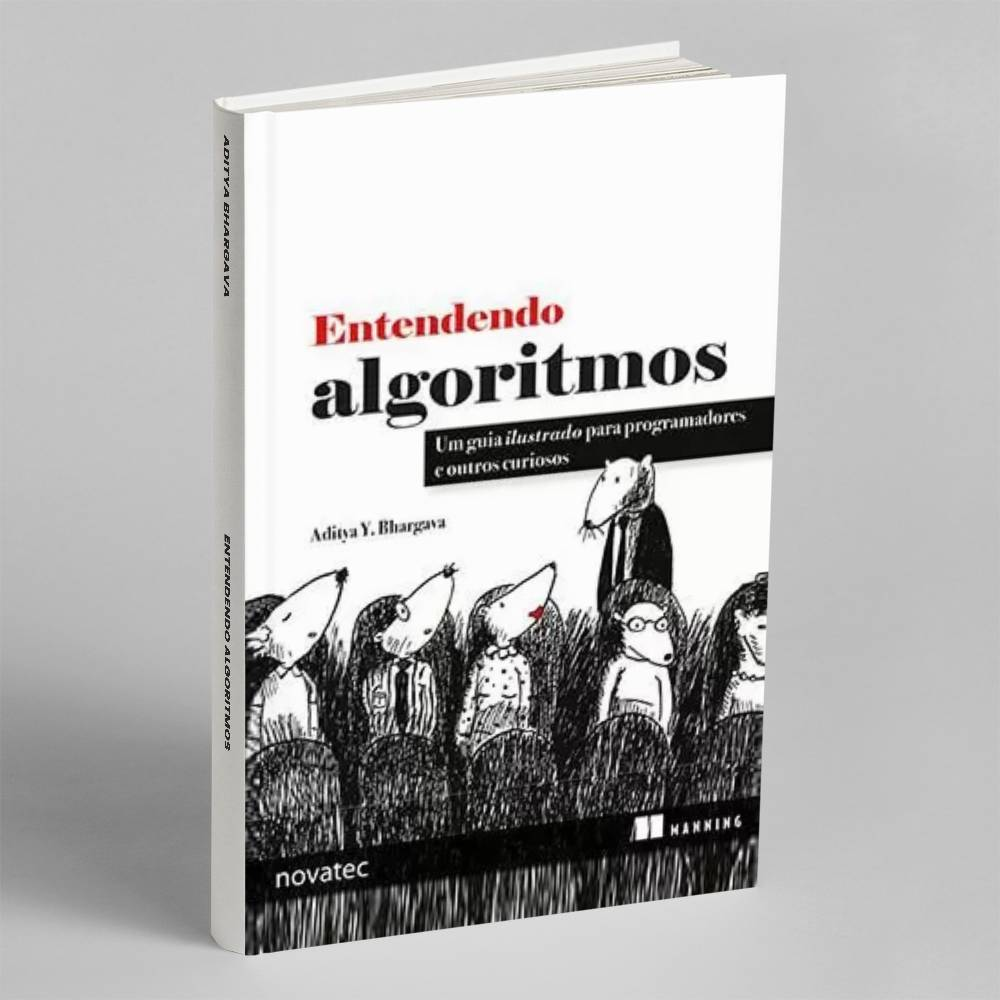

## Entendendo algoritmos

Esse é um livro de escrita simples e de fácil entendimento, porém engana-se quem acha que ele trata de coisas simples, 
tive que revisitar meu ensino médio (ou fundamental) para lembrar o que são logaritmos e exponenciais.

A leitura pode se tornar mais densa a medida que aplicamos os algoritmos seja em python (utilizado no livro), seja na sua linguagem de prefêrencia.

Nesta série de posts vamos juntos entender o livro **Entendendo Algoritmos** aplicando os algoritmos em diversas linguagens.