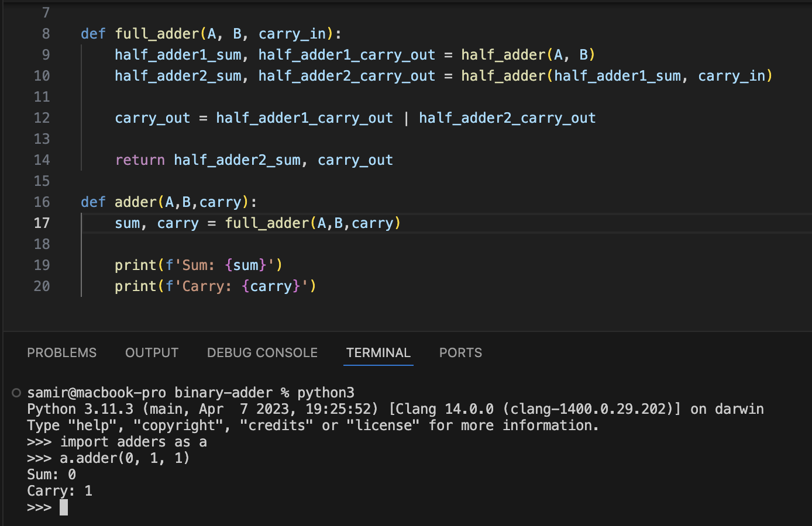
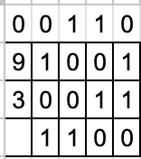
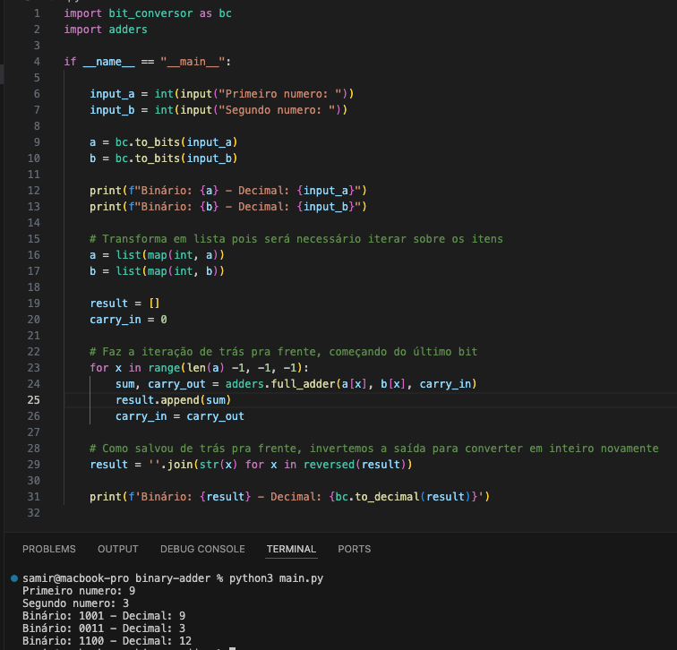

+++ 
draft = false
date = 2024-09-18T10:00:00-03:00
title = "Somador completo"
description = ""
slug = ""
authors = ["Samir Góes"]
tags = ["calculadora", "somador completo"]
categories = []
externalLink = ""
series = ["calculadora"]
+++

Tá SAMI, esse bit sobrando tava incomodando e eu não sabia onde enfiar ele.

Bom, FINALMENTE voltamos, demorei por motivos de FÉRIAS e ENROLAÇÃO. MAS VOLTEI

Esse post faz parte da série **Implementando uma calculadora binária** ou um título mais apropriado no futuro.

Antes de mais nada, vamos entender a soma dos bits:

### Vamos considerar a soma de dois bits (A e B):

0 + 0 = 0  
0 + 1 = 1  
1 + 0 = 1  
1 + 1 = 10 (que é equivalente a 2 em decimal)  

Quando somamos dois bits e o resultado é "10" (em binário), temos:

O bit da direita (0) é a soma.
O bit da esquerda (1) é o carry-out (ou vai-um), que é transportado para a próxima posição de bits.

> **A adição de números maiores que um bit envolve o uso do carry-out gerado na soma anterior.**

No post anterior realizamos uma soma de bits simples calculando 9 + 3, e tivemos dois valores um da **soma** e um **carry**.  Mas, logo no segundo bit a ser somado carregamos ainda um carry na soma, o que fazer agora se um meio somador só consegue lidar com dois bits de entrada?

Simples! Precisamos de um **somador completo.**

## Somador completo

Um somador completo é basicamente a utilização de dois meio somadores e uma operação OR para o carry-out de cada operação.

- Meio somador 1: Calcula a soma parcial de A e B, e gera um carry-out parcial.  
- Meio somador 2: Calcula a soma final com o valor da soma da primeira operação e do bit de carry-in e também gera um carry-out adicional.  
- Finalmente, o carry-out total é a combinação dos dois carry-out's (parcial e adicional).  

Se pegarmos agora o segundo bit de 9 (0) e de 3 (1) e aplicarmos o carry-out da soma anterior (1), conseguimos executar a soma:

Logo, poderemos então realizar essa operação para todos os bits da cadeia, ficando assim (o carry fica em cima):

> 1100 = 12 decimal

- A primeira soma recebe um zero no carry por não ter ocorrido nenhuma soma anterior

Código completo em python:

### E aquele carry zero lá em cima do número nove?
SPOILER: É a representação das limitações físicas de hoje!  
SPOLIER 2: Vamos fazer isso de forma eletrônica usando **transistores**

AGUARDEM!!!

O código está disponível também no meu Github: https://github.com/SamirGoes/binary-adder